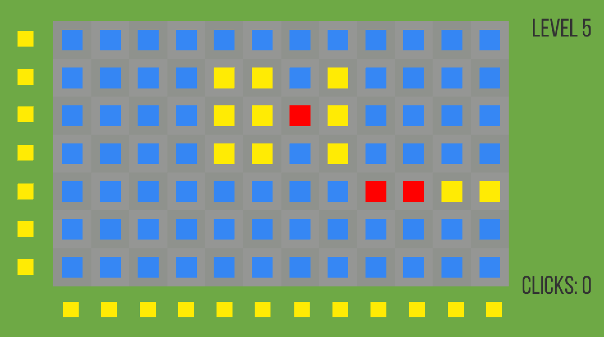

## Experimental Games

These are a few experimental games I made for different given topics in Unity / C#. Each game made under 15 hours as a challenge to my design and coding skills.

### Cubism

The topic of the game is "**Cubism**", an art movement led by Picasso and Braque, that essentially abandons normal perspective and distorts known figures and form, blurs the concept of depth and simultaneously present the object from multiple viewpoints.

Instead of just make a game that has cubism as its art style, I decided to incorporate the essence of cubism into the core gameplay of the game. Seeing the list of features of cubism, I decided to use **Misconception of Depth** and **Multiple Perspective Presentation** to mark the statement of the game. 

From the statement of the game, I came up with the idea of a 3D platformer. Firstly to present multiple perspective there has to be multiple perspective to begin with, that's why I went with 3D. And then a 3D platformer with the player being a simple cube would be easier to make as well as clearer to convey ideas.

To create the feeling of misconception with depth, I disabled lightings and used monotomic color. Orthographic cameras enhanced the confusion even further.

After that I decided that the cube should still be visible even when its covered by walls, but as a different color. This decrease the difficulty of the game a little bit, but more importantly it allows the player to get more imformation of the confusing-looking levels, thus enables the possibility of more interesting and complicated levels. So I wrote a shader using the stencil buffer using Cg. I used it to create the see-through effect of the cube.

### Bob is Working on a Experimental Game

 

The topic of this experiment is "**Sloth**", which means laziness, tendency to procrastinate or reluctancy to make efforts. I thought, why not **make a game about myself being slothful on making an experimental game**? 

The game starts at 8pm in game, and the goal is to finish making a game before 5am, which is my usual time of finishing a project. 

In the game you can interact with different objects by clicking on them, for example you can drink coffee, eat bananas, or put on music.. The cursor changes when its hovered on an interactable object.

There are three parameters: Energy, Mood and Motivation. All three of them have strong impact on the efficiency of me working. Also, there are a few things I could be doing, and actually working is only one of them. All of the things I do affects the parameters . For example, eating bananas give a boost for energy, playing PS vita decreases energy but increases mood, and motivation increases automatically because the deadline is getting closer and closer(so real right).

When I am distracted, the play can change whatever I am doing by clicking on me. The change is random between a set of actions, be the chance is determined by the three parameters.

When I am actually working, the player need to spam on the keyboards as fast as he can to get progress. When the progress reaches 100 percent, the player wins. If he fails to do so before the timer turns to 5am, he lose the game.

### Match 3

By the topic of "**Match 3**", My goal was to create a mobile puzzle game that utilizes the basic mechanics: grid swapping and grid changing when aligned.

In a grid, press the buttons to send in a colored square that swaps with all the other squares along the way. 

The game measure your score in each level by how many moves you took to complete the level.

The twist of the game is that when you set out to match 3 of the square, the rest of the grid is potentially changed by your action, so you need to plan out your actions carefully and execute them in the right order to get the best score.

### Games Of Vain

The topic is to "**disturb the comforted and comfort the disturbed**", so I thought of making a few classic games from the 70s and the 80s, and then change something fundamental about those games, to create the moment of simultaneous disturb and comfort when the player realize the game is absolutely pointless to play and feel challenged about their assumptions and knowledge of games.

I made two mini-games, *Pong* and *Tetris*. For *Pong*, I made the dotted lines in the middle inpassable, thus impossible to win. For *Tetris*, I completely removed the bounding box so the pieces wouldn't stack at all, also making it futile to play.

